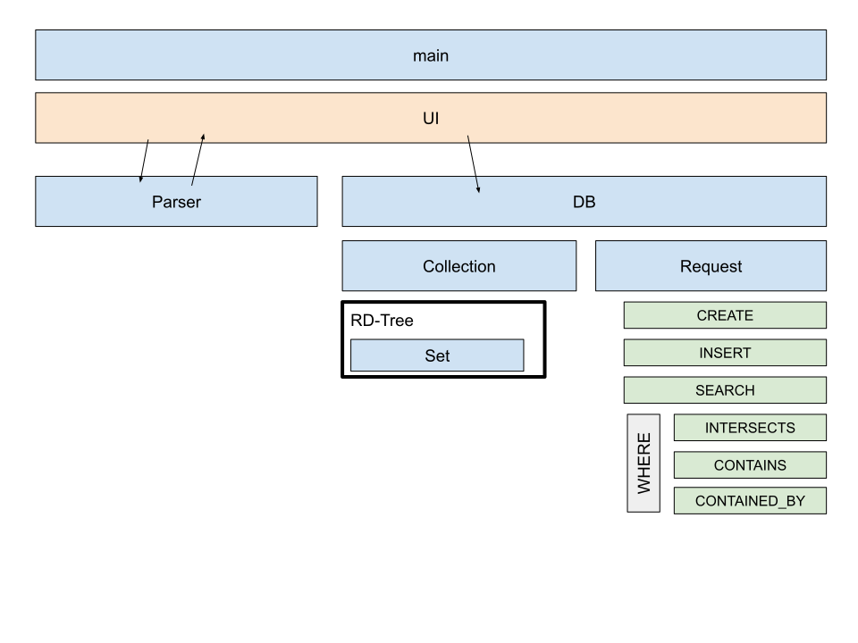

### Бригада
* Шморгун Данило (ФІ-91)
* Корешков Михайло (ФІ-91)

### Варіант
Варіант №16: Колекція числових множин на основі RD-дерева

---
### Progress

* [x] Parser
* [x] Print
* [ ] *Insert* **(In QA)**
* [ ] Search
* [ ] Search Where
  * [ ] Intersects
  * [ ] Contains
  * [ ] Contained by

---
## Project structure (draft)

